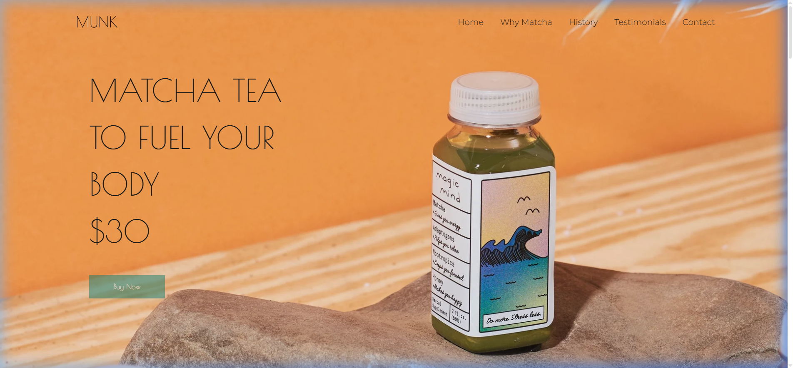
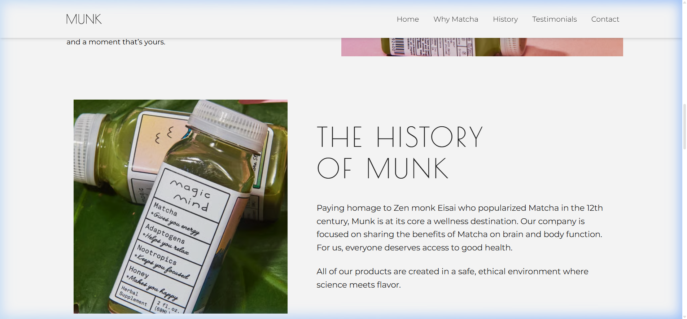
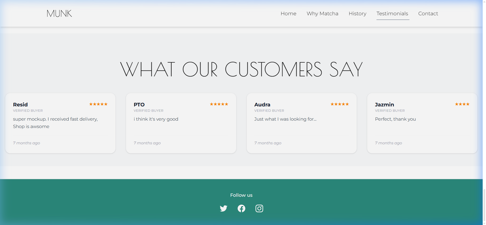
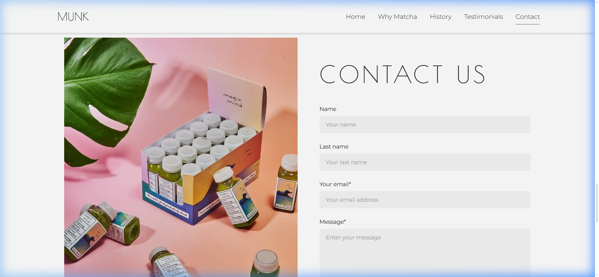
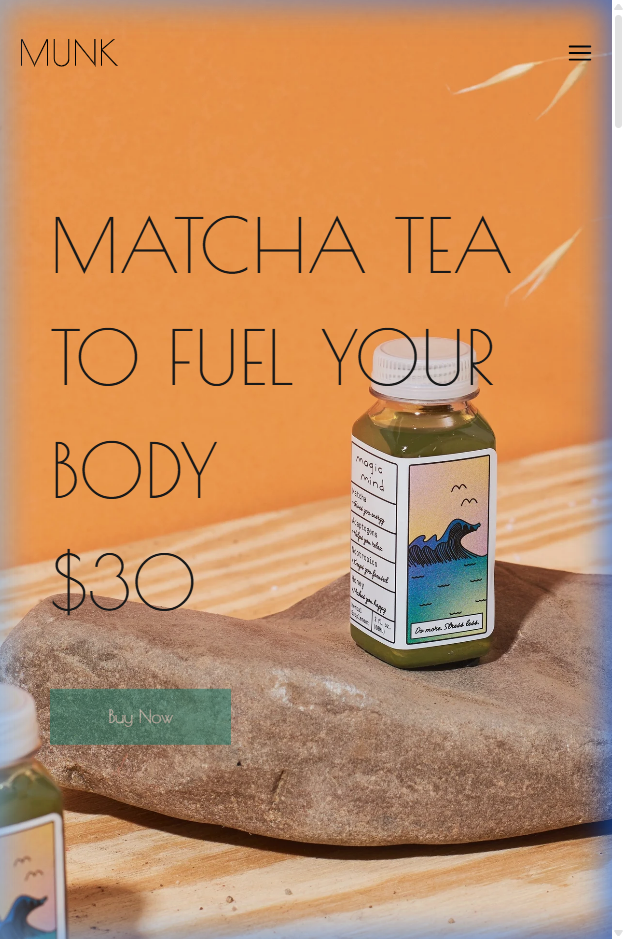
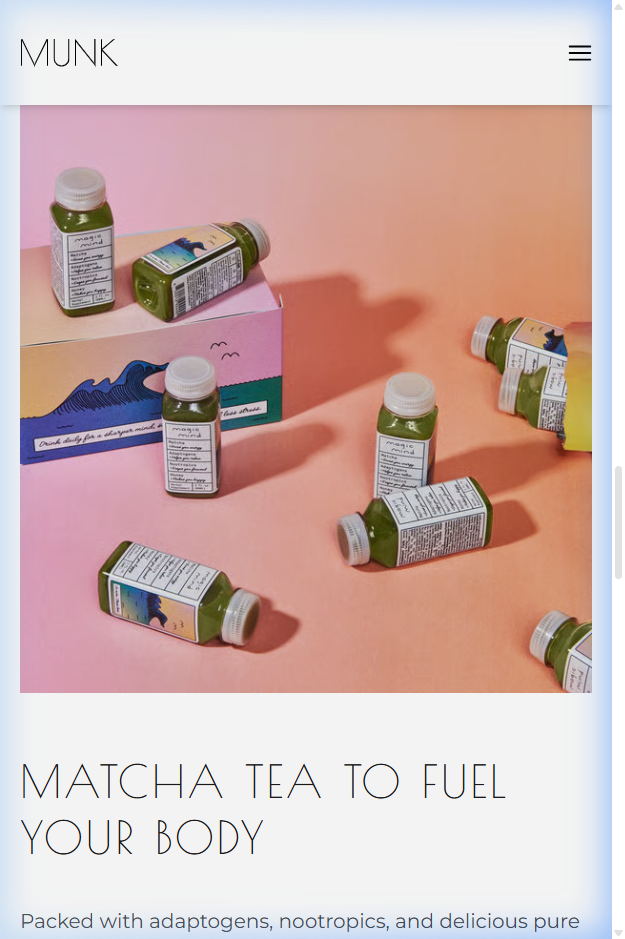
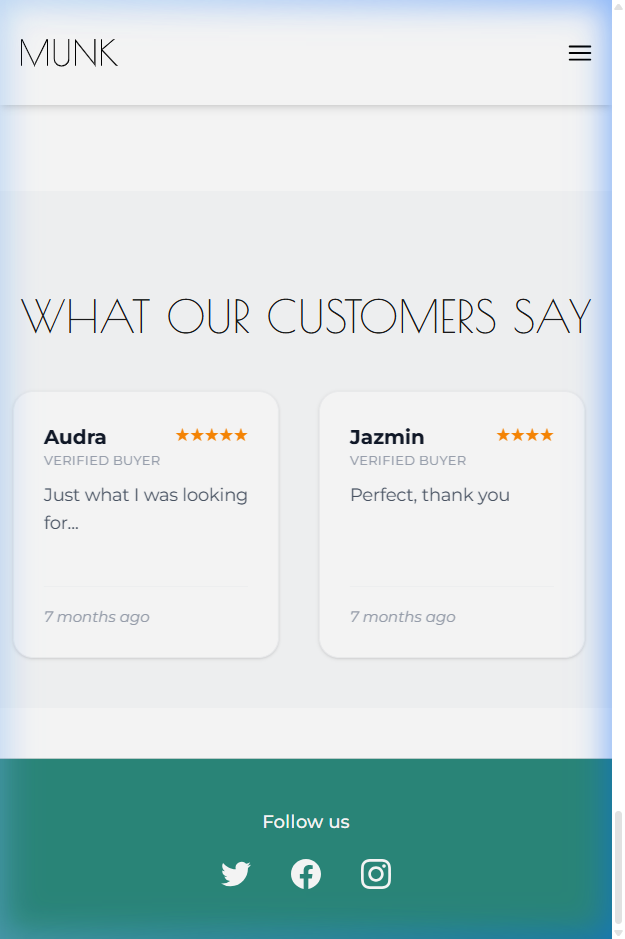

# Munk Tea — A Premium Matcha Experience

A high-performance, responsive landing page for Munk Tea, built with the latest React 19 and Tailwind CSS v4 to deliver a modern, zen-like aesthetic.

[**Live Demo**](https://ben26-12.github.io/munk-landing-ben/) | [**GitHub Repository**](https://github.com/Ben26-12/munk-landing-ben)

---

## Visual Showcase

### Desktop Experience


*Sequential sections showing the seamless transition:*


*Testimonials & Infinite Carousel:*


*Responsive Contact Form:*


---

### Mobile Experience
<div align="center">
  
  
  
</div>

---

## Tech Stack

| Category | Technology |
| :--- | :--- |
| **Core** | React 19, TypeScript, Vite |
| **Styling** | Tailwind CSS v4, CSS Variables |
| **Tools** | ESLint, PostCSS, Gh-Pages |

---

## Key Technical Features

### Seamless Infinite Carousel
Engineered a smooth, endless slider for testimonials by leveraging **Array Cloning** and CSS transitions. By dynamically resetting the index after the transition completes, it achieves a "jank-free" looping effect that feels natural and premium.

### Modern Styling & Layout
Utilized **Tailwind CSS v4** to define a unified Design System:
- **Custom Tokens**: Centralized variables for colors (like `--color-forest`) and animations directly in the CSS entry point.
- **Responsive Architecture**: A hybrid Flexbox/Grid system ensures the visual hierarchy remains consistent from mobile to desktop, with adaptive typography and spacing.

---

## Core Features

- **Smooth Scrolling**: Native browser implementation for seamless navigation.
- **Dynamic Product Display**: Optimized rendering of product details and pricing.
- **Mobile-First Design**: Fully responsive header and layout for all devices.
- **Interactive Sliders**: High-performance scrolling for customer reviews.

---

## Project Structure

```text
/src
├── Components
│   ├── Header           # Navigation bar with mobile menu
│   ├── MainBanner       # Hero section with large typography
│   ├── ProductSection   # Dynamic product showcase (Grid)
│   ├── ReviewCarousel   # Infinite-loop testimonial slider
│   ├── ...              # Other modular components (History, Contact)
│   └── constants.ts     # Centralized content and image links
├── App.tsx              # Application entry and layout orchestration
├── main.tsx             # React 19 root mounting
└── style.css            # Tailwind v4 theme and global styles
```

---

## Installation & Setup

1. **Clone the repository**
   ```bash
   git clone https://github.com/Ben26-12/munk-landing-ben.git
   cd munk-landing
   ```

2. **Install dependencies**
   ```bash
   npm install
   ```

3. **Start development server**
   ```bash
   npm run dev
   ```

---

*Developed with passion for high-end web experiences.*
